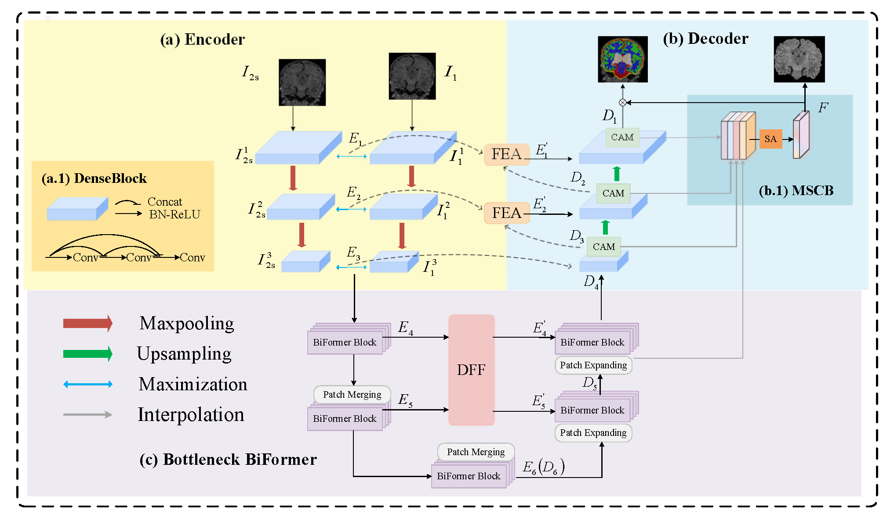

## SCAN: Skull-stripping Constrained Asymmetric Network with bottleneck Transformer for brain tissue segmentation

by ~


* We provide related codes and configuration files to reproduce the "SCAN: Skull-stripping Constrained Asymmetric Network with bottleneck Transformer for brain tissue segmentation"

## Introduction
SCAN is a novel 2D segmentation model that cleverly integrates 3D spatial context information using context slices to improve segmentation accuracy. The model adopts a hybrid architecture that introduces an efficient visual Transformer into the DenseNet backbone . This combination not only extracts local detail features but also captures global context information, providing comprehensive feature support for precise segmentation. Our Multi-Scale Constrained Block (MSCB) effectively focuses the network on the brain tissue segmentation region. Compared with other ways to limit the segmentation region, such as used in the CAN, this method eliminates the need for data preprocessing during the model inference phase, simplifies the segmentation process and improves efficiency.
In addition, the Dual-scale Feature Fusion module(DFF) and Feature Enhanced Attention (FEA) are responsible for fusing dual-scale features and enhancing the selection of skip-connection features respectively. DFF enhances the model's understanding of the global structure by integrating features of different scales, while FEA further improves the accuracy and robustness of segmentation through refined feature selection.


<div align="center">
  
</div>


## Citation
```
@article{
}
```

## Train
If you are prompted for no packages, enter pip install * * to install dependent packages
```
python train.py
```

## Test
```
python test.py
```
